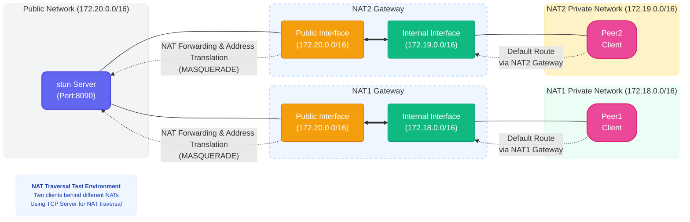

## NAT Traversal Demo

This project demonstrates how to implement Network Address Translation (NAT) traversal techniques, enabling devices behind different NAT networks to communicate directly. The project includes a simple NAT traversal implementation and a Docker environment for simulating real-world NAT network scenarios.

### What is NAT Traversal?

NAT traversal is a technique that allows devices located behind private networks (such as home or corporate networks) to communicate directly with similar devices, without requiring a public server to relay all data. In this demo, we use a STUN-like server to help two clients discover each other and establish a connection.

### Project Components

- STUN Server: Helps clients discover their public IP addresses and ports
- Two NAT Gateways: Simulate different private network environments
- Two Clients: Attempt to traverse NAT for direct communication
- Docker Environment: Provides isolated networks for testing

### Network Topology
The diagram below shows the network structure of the testing environment: two clients behind different NAT networks communicating through a STUN server.



### How to Use

1. Start the Environment and Run the STUN Server `nat-traversal`
```bash
# Start all Docker containers
$ docker-compose up -d
# Enter the STUN server container 
$ docker exec -it stun_server /bin/bash
# Get ip
$ ip addr
1: lo: <LOOPBACK,UP,LOWER_UP> mtu 65536 qdisc noqueue state UNKNOWN group default qlen 1000
    link/loopback 00:00:00:00:00:00 brd 00:00:00:00:00:00
    inet 127.0.0.1/8 scope host lo
       valid_lft forever preferred_lft forever
    inet6 ::1/128 scope host 
       valid_lft forever preferred_lft forever
2: eth0@if736: <BROADCAST,MULTICAST,UP,LOWER_UP> mtu 1500 qdisc noqueue state UP group default 
    link/ether 46:74:32:0a:6b:18 brd ff:ff:ff:ff:ff:ff link-netnsid 0
    inet 172.20.0.2/16 brd 172.20.255.255 scope global eth0
       valid_lft forever preferred_lft forever
# start the service
$ ./nat-traversal
```

2. Configure Client 1's Network
```bash
$ docker exec -it peer1 /bin/bash
# Set the default gateway (required to connect to the STUN server)
$ GATEWAY_IP=$(getent hosts nat1_gateway | awk '{print $1}') && \
         ip route del default && \
         ip route add default via $GATEWAY_IP
```

3. Configure Client 2's Network
```bash
$ docker exec -it peer2 /bin/bash
# Set the default gateway
$ GATEWAY_IP=$(getent hosts nat2_gateway | awk '{print $1}') && \
         ip route del default && \
         ip route add default via $GATEWAY_IP
```

4. Test NAT Traversal

Run the following commands on both clients (choose TCP or UDP mode):

#### TCP Mode Testing

```bash
$ ./nat-traversal 172.20.0.2:8090
```

output：
```bash
[2025-03-22T05:37:37Z INFO  nat_traversal_test::tcp] Listening on: 0.0.0.0:32827
[2025-03-22T05:37:51Z INFO  nat_traversal_test::tcp] Received address: 172.20.0.4:40879
[2025-03-22T05:37:51Z INFO  nat_traversal_test::tcp] Failed to connect to NAT: connection refused, Connection refused (os error 111)
[2025-03-22T05:37:51Z INFO  nat_traversal_test::tcp] remote addr: 172.20.0.4:40879
[2025-03-22T05:37:51Z INFO  nat_traversal_test::tcp] Received message: "Hello, world!"
```

#### UDP Mode Testing

```bash
$ ./nat-traversal 172.20.0.2:8090 -p udp
```

output：
```bash
[2025-03-22T05:38:32Z INFO  nat_traversal_test::udp] Received address: 172.20.0.4:54957
[2025-03-22T05:38:32Z INFO  nat_traversal_test::udp] Received message: Hello, world! from 172.20.0.4:54957
[2025-03-22T05:38:32Z INFO  nat_traversal_test::udp] Received message: yes from 172.20.0.4:54957
```

### Troubleshooting

- Connection Failures: These are normal and may require multiple attempts. If testing gets stuck, retry using these methods:
  - TCP Mode: Shut down both clients and restart them
  - UDP Mode: Wait for the STUN server to output Udp clear NAT address log before trying again

### Current Limitations

This is a simple demonstration project with the following limitations:

- Each protocol supports only two clients simultaneously
- Birthday attack port detection is not implemented
- Complex scenarios like dns64/dns46 are not supported
- No fallback forwarding when traversal fails
- IPv6 is not supported
- Testing in real network environments requires one public server and two servers behind NAT
